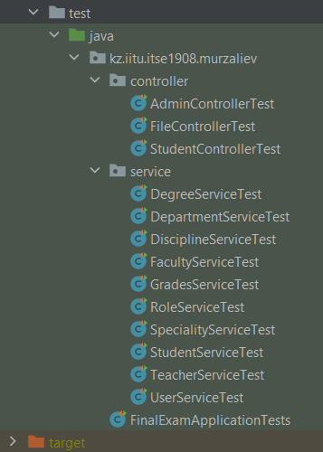

# Final Exam Project #
#### Prepared by Murzaliev Eldiiar ####
#### ITSE-1908 ####
## University Admission Management System ##

### Project Describtion ###
1) - [x] Database PostgeSQL. 10 Entities created;
2) - [x] Database backup file is in the project;
3) - [x] REDME.md is created;
4) - [x] Different types of Bean annotations are used;<details><summary>Annotations</summary><p>@Component</p><p>@Repository</p><p>@Service</p></details>
5) - [x] Only constructor and Setter injections are used;
````
    @Autowired
    public void setRole(Role role) {
        this.role = role;
    }
````
6) - [x] Good service logic in service classes;
7) - [x] Use annotations; <details><summary>Annotations</summary><p>@PropertySource</p><p>@Lazy</p><p>@Scope</p><p>@DependsOn</p></details>
8) - [x] Add at least 2 configuration classes;<details><summary>Configuration classes</summary><p>AppConfig.java</p><p>MvcConfig.java</p><p>SwaggerConfig.java</p><p>WebSecurityConfig.java</p></details>
9) - [x] Add AOP configuration. Use AspectJ annotation style.


10) - [x] Use annotations; <details><summary>Annotations</summary><p>@Before</p><p>@Pointcut</p><p>@After</p><p>@Aspect</p></deatils>
11) - [x] Add real service/business logic in AOP code; 
- After adding list of students to the discipline the advice creates and adds to the database corresponding list of grades.
- Before deleting discipline the advice deletes corresponding record in discipline_student and discipline_teacher table, because deleting discipline without this would cause deleting error in database.
12) - [x] **JdbcTemplate is used to access data in database;**

````
    @Bean
    JdbcTemplate jdbcTemplate(DataSource dataSource) {
        return new JdbcTemplate(dataSource);
    }
````

13) - [x] Use batch operations;


14) - [x] Implement a Custom Converter;

````
public class StringToDegree implements Converter<String, Degree>
````

15) - [x] Implement a Custom Formatter;

````
public class DegreeFormatter implements Formatter<Degree>
````

16) - [x] Use AssertTrue for Custom Validation;

````
public @interface AssertTrue {
    String message() default "ERROR!";
    ....
}
````

17) - [x] Write scheduled method. Use @Scheduled annotations
with attributes; <details><summary>Attributes</summary><p>fixedDelay</p><p>fixedRate</p><p>initialDelay</p></details>

````
    @Scheduled(fixedDelayString = "${fixedDelay}", initialDelayString = "${initialDelay}")
````

18) - [x] .Parameterizing the Schedule. Parameters should be in application.props file;


19) - [x] **Run Tasks in Parallel;**

````
    @Async("threadPoolTaskScheduler")
````

20) - [x] Use all HTTP Methods;
21) - [x] Use next annotations; <details><summary>Annotations</summary><p>@GetMapping</p><p>@PutMapping</p><p>@PostMapping</p><p>@DeleteMapping</p></details>
22) - [x] Use RequestBody and ResponseBody Annotations;

````
@RequestBody Grades grades
````

23) - [x] Setting Up Spring openapi;

````
<dependency>
    <groupId>org.springdoc</groupId>
    <artifactId>springdoc-openapi-ui</artifactId>
    <version>1.6.4</version>
</dependency>
````


24) - [x] Use Spring @ResponseStatus to Set HTTP Status Code. 
Use SpringResponseEntity to Manipulate the HTTP Response;


25) - [ ] Add REST Pagination support;
26) - [x] Add Upload and Download file methods;


27) - [x] Add JUnit test with at least 80% code coverage;
28) - [x] Write integration test for controller classes;



29) - [ ] Write JMS service;
30) - [x] Add JUnit test with at least 80% code coverage;
31) - [x] Use OAuth2 and JWT;

OAuth2 with Google as provider.


32) - [x] DO NOT USE in memory authentication;
33) - [ ] Prevent Brute Force Authentication Attempts with Spring Security
34) - [ ] Control the Session with Spring Security;
35) - [ ] Fix 401s with CORS Preflights and Spring Security
36) - [ ] Prevent Cross-Site Scripting (XSS) in a Spring Application
37) - [ ] Add 1-2 pages which supports websocket technology;
38) - [x] Write CURL in README.md for your ALL endpoints, or upload inproject folder POSTMAN collections

- Getting students by discipline for teacher


- Accessing teachers' controller


- Getting student's grades


- Grading student


Error codes:

- 10 - record already exists
- 11 - record doesn't exist
- 100 - it's examination session period. You can not change grades anymore!
- 1001 - no access to this controller!


